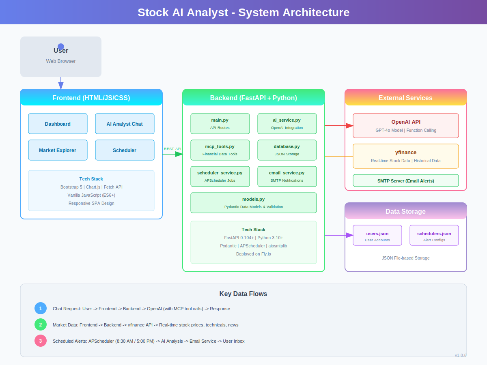

# Stock AI Analyst - Architecture Documentation

## Architecture Diagram



## System Overview

Stock AI Analyst is an AI-powered stock analysis application that combines real-time financial data from yfinance with OpenAI's GPT-4o model to provide intelligent market insights, stock recommendations, and automated alerts. The system follows a client-server architecture with a FastAPI backend and a vanilla JavaScript frontend.

## High-Level Architecture

```
+------------------+     HTTPS      +------------------+     API Calls    +------------------+
|                  | <------------> |                  | <--------------> |                  |
|  Web Frontend    |                |  FastAPI Backend |                  |  External APIs   |
|  (HTML/JS/CSS)   |                |  (Python)        |                  |  - OpenAI GPT-4o |
|                  |                |                  |                  |  - yfinance      |
+------------------+                +------------------+                  +------------------+
                                           |
                                           v
                                    +------------------+
                                    |  Data Storage    |
                                    |  (JSON Files)    |
                                    +------------------+
```

## Component Architecture

### Backend Components

The backend is built with FastAPI and organized into distinct service modules:

```
stock-ai-backend/
├── app/
│   ├── __init__.py
│   ├── main.py           # FastAPI application entry point and API routes
│   ├── models.py         # Pydantic data models for request/response validation
│   ├── mcp_tools.py      # MCP-based tools for financial data retrieval
│   ├── ai_service.py     # OpenAI integration and AI analysis logic
│   ├── database.py       # JSON-based data persistence layer
│   ├── email_service.py  # SMTP email service for notifications
│   └── scheduler_service.py  # APScheduler for automated alerts
├── data/                 # Runtime data storage (users, schedulers)
├── pyproject.toml        # Poetry dependencies
├── requirements.txt      # Pip dependencies
└── .env.example          # Environment variable template
```

#### Core Services

**1. MCP Tools (mcp_tools.py)**

The MCPStockTools class provides a unified interface for financial data retrieval using yfinance. It implements the following capabilities:

- `get_stock_info()` - Retrieves comprehensive stock information including price, fundamentals, and company details
- `get_historical_data()` - Fetches historical OHLCV data with configurable periods and intervals
- `get_stock_news()` - Retrieves recent news articles for a given stock
- `get_financials()` - Returns income statement, balance sheet, and cash flow data
- `get_recommendations()` - Fetches analyst recommendations and ratings
- `get_market_indices()` - Returns data for major indices (S&P 500, Dow Jones, NASDAQ, etc.)
- `get_top_movers()` - Identifies top gaining and losing stocks/ETFs
- `analyze_stock_technicals()` - Calculates technical indicators (SMA, RSI, MACD)
- `search_stocks()` - Searches for stocks by name or symbol

**2. AI Service (ai_service.py)**

The AIStockAnalyst class integrates with OpenAI's GPT-4o model and implements function calling to leverage MCP tools:

- Maintains a system prompt that defines the AI's role as a financial analyst
- Defines tool schemas for OpenAI function calling
- Executes tool calls and processes results
- Provides three main methods:
  - `chat()` - Interactive conversation with tool-augmented responses
  - `generate_market_summary()` - Creates AI-powered market overviews
  - `generate_stock_recommendation()` - Produces buy/sell/hold recommendations

**3. Database Service (database.py)**

A lightweight JSON-based persistence layer for user and scheduler data:

- User management: create, authenticate, retrieve users
- Scheduler management: CRUD operations for alert configurations
- Password hashing using SHA-256
- UUID-based entity identification

**4. Email Service (email_service.py)**

Async email service using aiosmtplib for sending notifications:

- Supports both plain text and HTML email formats
- Sends welcome emails on user registration
- Delivers market alert emails with formatted analysis

**5. Scheduler Service (scheduler_service.py)**

APScheduler-based service for automated alerts:

- Morning alerts at 8:30 AM (1 hour before market open)
- Evening alerts at 5:00 PM (after market close)
- Processes active schedulers and generates AI analysis
- Supports manual alert triggering for testing

### Frontend Components

The frontend is a single-page application built with vanilla JavaScript and Bootstrap 5:

```
stock-ai-frontend/
├── index.html           # Main HTML structure with navigation and modals
├── css/
│   └── styles.css       # Custom styles
└── js/
    ├── config.js        # API endpoint configuration
    ├── api.js           # HTTP client for backend communication
    ├── app.js           # Main application controller and routing
    ├── auth.js          # Authentication state management
    ├── dashboard.js     # Dashboard page logic
    ├── chat.js          # AI Analyst chat interface
    ├── explorer.js      # Market Explorer functionality
    └── scheduler.js     # Scheduler management UI
```

#### Page Modules

**1. Dashboard (dashboard.js)**
- Displays major market indices with real-time data
- Shows top gainers and losers
- Renders AI-generated market summary
- Auto-refreshes data periodically

**2. AI Analyst Chat (chat.js)**
- Interactive chat interface for stock analysis
- Supports symbol-specific queries
- Maintains conversation history
- Displays AI responses with formatted analysis

**3. Market Explorer (explorer.js)**
- Stock search functionality
- Detailed stock information display
- Interactive price charts using Chart.js
- Technical indicators visualization

**4. Scheduler (scheduler.js)**
- Create/edit/delete alert configurations
- Select morning or evening trigger times
- Specify symbols for targeted analysis
- Test alerts manually

## Data Flow

### Chat Request Flow

```
User Input -> Frontend (chat.js)
    |
    v
POST /api/chat -> main.py
    |
    v
ai_service.chat() -> OpenAI API
    |
    v
Tool Calls -> mcp_tools.py -> yfinance
    |
    v
Tool Results -> OpenAI API (continued)
    |
    v
Final Response -> Frontend -> User
```

### Scheduled Alert Flow

```
APScheduler Trigger (8:30 AM / 5:00 PM)
    |
    v
scheduler_service._process_alerts()
    |
    v
Load Active Schedulers -> database.py
    |
    v
For Each Scheduler:
    |
    v
ai_analyst.generate_stock_recommendation() / generate_market_summary()
    |
    v
email_service.send_market_alert()
    |
    v
User Email Inbox
```

## API Endpoints

### Authentication
| Method | Endpoint | Description |
|--------|----------|-------------|
| POST | /api/auth/register | Register new user |
| POST | /api/auth/login | Authenticate user |

### Chat
| Method | Endpoint | Description |
|--------|----------|-------------|
| POST | /api/chat | Send message to AI analyst |

### Market Data
| Method | Endpoint | Description |
|--------|----------|-------------|
| GET | /api/market/summary | Market overview with indices and movers |
| GET | /api/market/ai-summary | AI-generated market analysis |
| GET | /api/market/indices | Major market indices |
| GET | /api/market/movers | Top gainers and losers |

### Stock Data
| Method | Endpoint | Description |
|--------|----------|-------------|
| GET | /api/stocks/{symbol} | Stock information |
| GET | /api/stocks/{symbol}/history | Historical price data |
| GET | /api/stocks/{symbol}/news | Recent news articles |
| GET | /api/stocks/{symbol}/technicals | Technical indicators |
| GET | /api/stocks/{symbol}/financials | Financial statements |
| GET | /api/stocks/{symbol}/recommendations | Analyst recommendations |
| GET | /api/stocks/{symbol}/ai-analysis | AI-powered analysis |
| GET | /api/search | Search stocks by query |

### Scheduler
| Method | Endpoint | Description |
|--------|----------|-------------|
| POST | /api/scheduler | Create new scheduler |
| GET | /api/scheduler/user/{user_id} | Get user's schedulers |
| GET | /api/scheduler/{scheduler_id} | Get scheduler details |
| PUT | /api/scheduler/{scheduler_id} | Update scheduler |
| DELETE | /api/scheduler/{scheduler_id} | Delete scheduler |
| POST | /api/scheduler/{scheduler_id}/test | Test scheduler manually |
| GET | /api/scheduler/next-runs | Get next scheduled run times |

## Technology Stack

### Backend
- **Framework**: FastAPI 0.104+
- **Language**: Python 3.10+
- **AI Model**: OpenAI GPT-4o
- **Financial Data**: yfinance
- **Scheduler**: APScheduler
- **Email**: aiosmtplib
- **Validation**: Pydantic

### Frontend
- **Framework**: Vanilla JavaScript (ES6+)
- **UI Library**: Bootstrap 5.3
- **Icons**: Bootstrap Icons
- **Charts**: Chart.js
- **HTTP Client**: Fetch API

### Infrastructure
- **Backend Hosting**: Fly.io
- **Frontend Hosting**: Static file server / CDN
- **Data Storage**: JSON files (can be upgraded to SQLite/PostgreSQL)

## Security Considerations

### Authentication
- Password hashing using SHA-256
- Session-based authentication stored in localStorage
- No JWT tokens (simplified for demo purposes)

### API Security
- CORS enabled for cross-origin requests
- Input validation via Pydantic models
- Error handling to prevent information leakage

### Secrets Management
- Environment variables for sensitive configuration
- `.env` file excluded from version control
- API keys never exposed to frontend

### Recommendations for Production
- Implement JWT-based authentication
- Add rate limiting to prevent abuse
- Use HTTPS for all communications
- Migrate to a proper database (PostgreSQL)
- Add request logging and monitoring
- Implement API key rotation

## Deployment Architecture

### Current Deployment

```
                    Internet
                        |
        +---------------+---------------+
        |                               |
        v                               v
+------------------+           +------------------+
|  Frontend CDN    |           |  Fly.io Backend  |
|  (Static Files)  |           |  (FastAPI)       |
+------------------+           +------------------+
                                       |
                                       v
                               +------------------+
                               |  External APIs   |
                               |  - OpenAI        |
                               |  - yfinance      |
                               +------------------+
```

### Environment Variables

| Variable | Description | Required |
|----------|-------------|----------|
| OPENAI_API_KEY | OpenAI API key for GPT-4o | Yes |
| SMTP_HOST | SMTP server hostname | No |
| SMTP_PORT | SMTP server port | No |
| SMTP_USER | SMTP username/email | No |
| SMTP_PASSWORD | SMTP password | No |

## Future Enhancements

### Planned Features
- Real-time WebSocket updates for live market data
- Portfolio tracking and performance analytics
- Social features (share analysis, follow analysts)
- Mobile application (React Native)
- Advanced charting with TradingView integration

### Technical Improvements
- Database migration to PostgreSQL
- Redis caching for frequently accessed data
- Message queue for async processing
- Kubernetes deployment for scalability
- Comprehensive test suite (unit, integration, e2e)

## Appendix

### Data Models

**User**
```python
{
    "id": "uuid",
    "email": "string",
    "name": "string",
    "password_hash": "string",
    "created_at": "datetime"
}
```

**Scheduler**
```python
{
    "id": "uuid",
    "user_id": "uuid",
    "prompt": "string",
    "trigger_time": "morning|evening",
    "symbols": ["string"],
    "is_active": "boolean",
    "created_at": "datetime"
}
```

### Technical Indicators

The system calculates the following technical indicators:

- **SMA (Simple Moving Average)**: 20-day, 50-day, 200-day
- **RSI (Relative Strength Index)**: 14-period
- **MACD (Moving Average Convergence Divergence)**: 12/26/9 periods

### Market Indices Tracked

- S&P 500 (^GSPC)
- Dow Jones Industrial Average (^DJI)
- NASDAQ Composite (^IXIC)
- Russell 2000 (^RUT)
- VIX Volatility Index (^VIX)
- FTSE 100 (^FTSE)
- Nikkei 225 (^N225)
- Hang Seng Index (^HSI)
